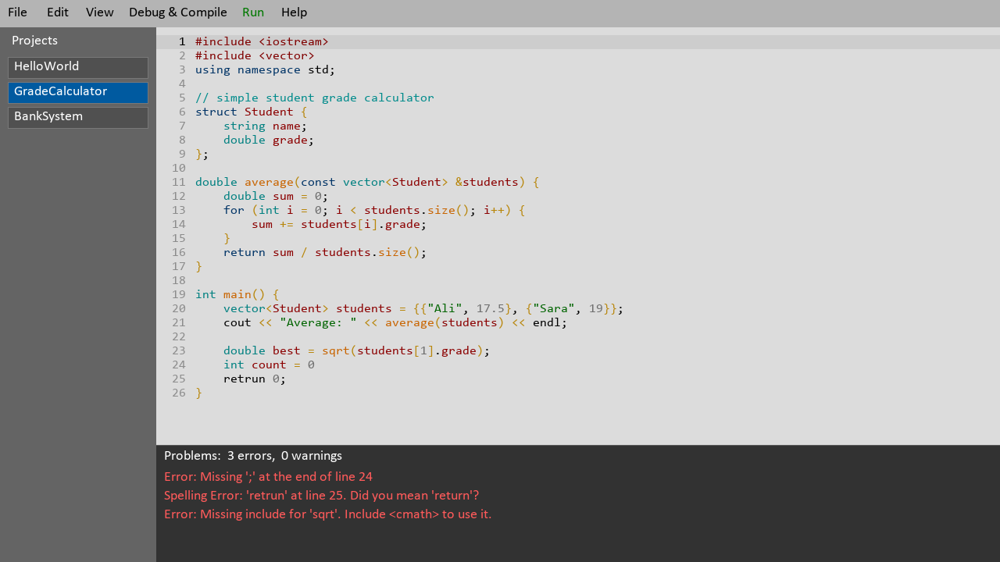

<p align="center">
  
</p>

<h1 align="center">CMorgh IDE</h1>

<p align="center">
  A small C++ IDE written in C++ with SDL2.<br>
  Our final project for the <b>Fundamentals of Programming</b> course (first semester, Electrical Engineering, Fall 2024).
</p>

<p align="center">
  
</p>

## About

CMorgh is a simple IDE for writing, checking and running C++ programs. Everything you see in the window
(the menus, the editor, the project list, the dialogs) is drawn by hand with SDL2 and SDL2_ttf, there is
no GUI library behind it. We wanted to see how much of a "real" IDE we could build with only the things
we learned in our first semester, plus a lot of googling.

It has a text editor with syntax highlighting, a projects panel, a live error panel that checks your code
while you type, and it can compile and run the code with `g++`.

## Features

**Editor**
- Syntax highlighting for keywords, data types, functions, variables, strings, numbers, comments and `#include`s
- Light mode and dark mode
- Auto closing for `()`, `[]`, `{}`, `""` and `''`
- Auto indentation (also puts `}` on its own line when you press Enter between `{}`)
- Selecting text with Shift + arrow keys or by dragging the mouse
- Cut / Copy / Paste (uses the system clipboard)
- Undo / Redo
- Go to line
- Autocomplete for keywords, functions and common words (works for typos too, `retrun` -> `return`)

**Projects**
- Save / Save As (you can pick the folder)
- All saved projects show up in the left panel, click one to open it
- The window title shows a `*` when there are unsaved changes, and the IDE asks before you lose them

**Error panel** (updates while you type)
- Missing semicolons
- Unclosed or mismatched brackets
- Unclosed strings, chars and `/* */` comments
- Misspelled keywords (`retrun`, `whlie`, `itn`, ...)
- Invalid variable names (`int 2x;`, `int return;`)
- Variables that are used but never declared
- Using `cout`, `sqrt`, `vector`, ... without the right `#include`
- Calling a function with the wrong number of arguments
- Warning for long `else if` chains (suggests `switch`)

**Compile and run**
- **Debug & Compile** runs `g++` and shows the real compiler errors in the error panel
- **Run** compiles and opens the program in a new console window, so `cin` works normally

## Keyboard shortcuts

| Shortcut | Action |
|---|---|
| `Ctrl + N` | New project |
| `Ctrl + S` | Save |
| `Ctrl + Shift + S` | Save as |
| `Ctrl + Z` / `Ctrl + Y` | Undo / Redo |
| `Ctrl + X` / `Ctrl + C` / `Ctrl + V` | Cut / Copy / Paste |
| `Ctrl + A` | Select all |
| `Ctrl + G` | Go to line |
| `Ctrl + Space` | Complete a keyword |
| `Ctrl + Shift + F` | Complete a function name |
| `Ctrl + Shift + G` | Complete a general word |
| `F5` | Compile and run |
| `F7` | Debug & compile |
| `F1` | Help |

## Building

The project is made for **Windows** with **MinGW (g++)**. We used CLion, but plain CMake works too.

### Requirements
- MinGW g++ (C++17)
- [SDL2](https://github.com/libsdl-org/SDL/releases) and [SDL2_ttf](https://github.com/libsdl-org/SDL_ttf/releases) development libraries for MinGW
  (copy their `include` and `lib` folders into your MinGW folder)
- CMake 3.16 or newer

### Build with CLion
Open the folder in CLion and press Run. That's it.

### Build from the command line
```bash
cmake -S . -B build -G "MinGW Makefiles"
cmake --build build
```

Then run `build/CMorghIDE.exe`. You can also open a file directly:
```bash
build/CMorghIDE.exe myprogram.cpp
```

> **Note:** `SDL2.dll` and `SDL2_ttf.dll` must be next to the exe or somewhere in your `PATH`.
> `g++` also has to be in the `PATH`, otherwise Compile and Run won't work.

## Project structure

```
CMorghIDE/
├── assets/
│   ├── icon.bmp          window icon
│   ├── logo.png
│   └── screenshot.png
├── src/
│   └── TextEditor.cpp    the whole IDE
└── CMakeLists.txt
```

When you use the IDE it also creates `projects.txt` (the list of saved projects) and `temp_project.cpp`
(the file that gets compiled) in the folder it runs from.

## How the error checking works

The error panel is **not** a real compiler. Every check is written by us using regex and some simple rules,
for example "a line that doesn't end with `;`, `{`, `}` or `:` and isn't an `if`/`for`/function header is
probably missing a semicolon". Before checking, comments and the text inside strings are removed so they
don't cause fake errors. The checks only run when the code changes, not every frame.

Because of this it can still miss errors or show a wrong one in unusual code. For the real errors
use **Debug & Compile**, which shows the output of `g++`.

## Known limitations

- Windows only (fonts are loaded from `C:\Windows\Fonts` and programs are run with `cmd`)
- Only ASCII text is supported
- One file per project
- No syntax highlighting for multi-line strings / raw strings

## What we learned

- Working with a C library (SDL2) from C++: windows, renderers, textures, events
- Building UI from scratch (hit testing, menus, scrolling, clipping)
- Using `std::regex`, `std::map`, `std::set`, `std::stack` for real problems
- Edit distance (Levenshtein) for the spell checker and autocomplete
- Running other programs from C++ with `popen` / `system`
- A lot of debugging :)

## Authors

- **Mehrshad** - [@mehrshot](https://github.com/mehrshot)
- **Ernika** - [@erthehogwartsdropout](https://github.com/erthehogwartsdropout)
